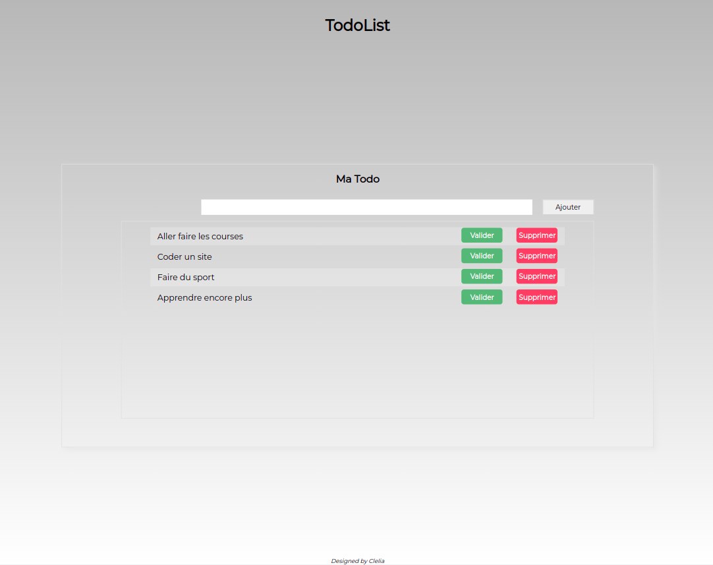

# TodoList

This is simple TodoList realized in PHP. 

## Table of contents

- [Overview](#overview)
  - [Screenshot](#screenshot)
- [My process](#my-process)
  - [Built with](#built-with)
- [Author](#author)

## Overview

### Screenshot

## My process

### Built with

- Semantic HTML5 markup
- CSS custom properties
- Flexbox
- PHP

## Author

- Website - [Clelia](https://cleliacarniel.com/)

